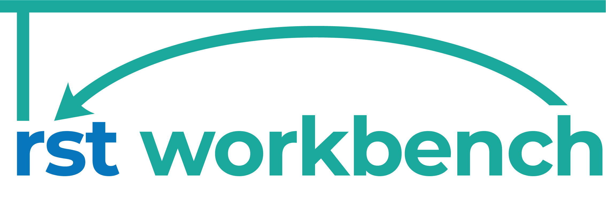
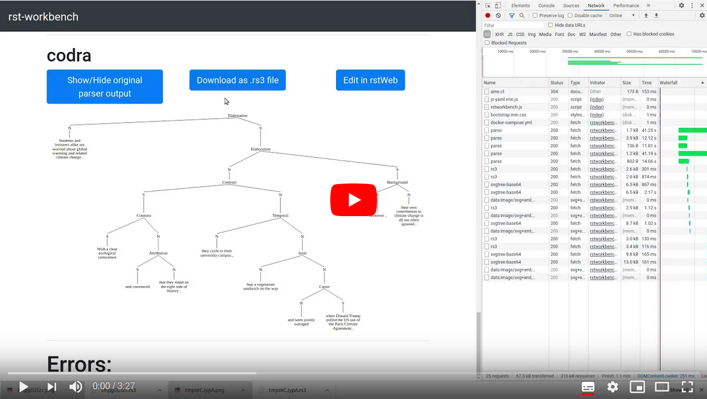

# rst-workbench

<div>
 The `rst-workbench` lets you easily
install and run existing RST parsers usind Docker containers.
It provides a convenient web app for visually comparing and post-editing
the trees produced by the RST parsers.
</div>

Here's a video demonstrating its usage:

<div>
<a href="https://www.youtube.com/watch?v=-zpdhp5nu-M">
  
</a>
 
You can also try our demo server: https://rst-workbench.arne.cl/ .
</div>


## Supported Parsers

Currently, we support the following RST parsers that we provide as Docker
containers with a REST API and pre-trained on RST-DT:

### [HILDA (Hernault et al. 2010)](https://github.com/nlpbox/hilda-service)

*Description*: REST API around the HILDA RST parser ([Hernault et al. 2010](http://journals.linguisticsociety.org/elanguage/dad/article/download/591/591-2300-1-PB.pdf)).
HILDA itself is only available from the [Prendinger lab](http://research.nii.ac.jp/%7Eprendinger/),
so we can't provide automated builds but only the build scripts here.

### [Feng and Hirst (2014)](https://github.com/NLPbox/feng-hirst-service)

[](https://travis-ci.org/NLPbox/feng-hirst-service)
[](https://hub.docker.com/r/nlpbox/feng-hirst-service)

*Description*: REST API around the [Feng and Hirst (2014)](https://www.aclweb.org/anthology/P14-1048/) RST parser.

### [DPLP (Ji and Eisenstein 2014)](https://github.com/NLPbox/dplp-service)

[](https://travis-ci.org/NLPbox/dplp-service)
[](https://img.shields.io/docker/build/nlpbox/dplp-service.svg)

*Description*: REST API around the DPLP RST parser [(Ji and Eisenstein 2014)](https://www.aclweb.org/anthology/P14-1002/).

### [Heilman and Sagae (2015)](https://github.com/NLPbox/heilman-sagae-2015-service)

[](https://travis-ci.org/NLPbox/heilman-sagae-2015-service)
[](https://hub.docker.com/r/nlpbox/heilman-sagae-2015-service/)

*Description*: REST API around the [Heilman and Sagae (2015)](https://arxiv.org/abs/1505.02425) RST parser.

### [CODRA (Joty et al. 2015)](https://github.com/NLPbox/codra-service)

*Description*: REST API around the CODRA RST parser [(Joty et al. 2015)](https://www.mitpressjournals.org/doi/abs/10.1162/COLI_a_00226).


### [StageDP (Wang et al. 2017)](https://github.com/nlpbox/stagedp-service)

*Description*: REST API around the StageDP [(Wang et al. 2017)](https://www.aclweb.org/anthology/P17-2029/) RST parser.
Since the parser requires EDU-segmented input, we combine it with a REST API
around the NeuralEDUSeg discourse segmenter from the same author [(Wang et al. 2018)](https://www.aclweb.org/anthology/D18-1116/).


## Troubleshooting

If running the rst-workbench with the command ``docker-compose up`` produces
an unexpected error like this one,

```
Starting rst-workbench_rst-converter-service_1 ... done
Attaching to rst-workbench_rst-converter-service_1
rst-converter-service_1  | xvfb-run: error: Xvfb failed to start
rst-workbench_rst-converter-service_1 exited with code 1
```

try to run it using ``DOMAIN=localhost docker-compose up --build --force-recreate`` instead.
``HOSTNAME`` refers to the name under which the host machine (i.e. the machine on which you run
``docker-compose``) is reachable from the outside world.
If you set the ``HOSTNAME`` to ``localhost``, the rst-workbench will be only available on the
machine were you run this command.
